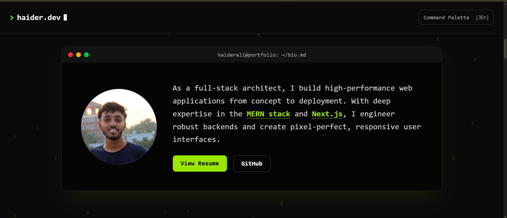

# Portfolio Terminal - An Interactive Developer Portfolio

 Welcome to my personal portfolio, redesigned from the ground up to be more than just a resume. This project is an immersive, interactive "terminal" experience that showcases my skills and projects in a creative, developer-focused environment.

**🔗 Live Demo:** [**https://codebyhaider.com**](https://codebyhaider.com)

---

## ✨ Features

This portfolio is built as a cohesive application with a unified, high-tech theme.

- **Interactive Terminal UI:** The entire portfolio is designed to feel like a modern, interactive terminal, from the "boot-up" sequence on the hero section to the "Git log" style project showcase.
- **Live Animated Background:** A performant, interactive canvas animation of a binary field runs across the entire site, reacting to the user's mouse movements.
- **Thematic Components:** Every section is a creative interpretation of a developer tool:
  - **About:** An "IDE-style" bio with interactive keywords that reveal tooltips on hover.
  - **Experience:** A "system event log" that details my professional history with a live typewriter effect.
  - **Projects:** A "Git commit log" that showcases my work as a series of commits.
  - **Contact:** An interactive "SSH connection" sequence that resolves into a functional contact form.
- **Fully Responsive:** The entire application is meticulously designed to be smooth, performant, and visually consistent on all devices, from the smallest phone to the widest desktop.

---

## 🛠️ Tech Stack

This project is a frontend application built with a modern, powerful stack.

- **Framework:** [React](https://reactjs.org/) (via Vite)
- **Styling:** [Tailwind CSS](https://tailwindcss.com/)
- **Animation:** [Framer Motion](https://www.framer.com/motion/)
- **Typed Text Effect:** [ReactTyped](https://www.npmjs.com/package/react-typed)
- **Deployment:** [Hostinger](https://www.hostinger.com/)

---

## 🚀 Getting Started

To get a local copy up and running, follow these simple steps.

### Prerequisites

Make sure you have Node.js and npm installed on your machine.

- npm
  ```sh
  npm install npm@latest -g
  ```

### Installation

1.  Clone the repo
    ```sh
    git clone [https://github.com/ha1derrr/codebyhaider.git](https://github.com/ha1derrr/codebyhaider.git)
    ```
2.  Install NPM packages
    ```sh
    npm install
    ```
3.  Run the development server
    ```sh
    npm run dev
    ```
4.  Open [http://localhost:5173](http://localhost:5173) (or the port shown in your terminal) to view it in the browser.

---

## 📬 Contact

Haider Ali - work.haiderali2002@gmail.com

Project Link: [https://github.com/ha1derrr/codebyhaider](https://github.com/ha1derrr/codebyhaider)
